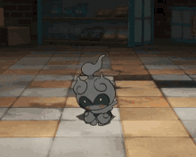

<h1 align="center">$\color{purple}{\text{SHADOW VOIDH}}$</h1>

> [!WARNING]
> Shadow Voidh é o Melhor de todos os Tempo .

---

  

### About me:
Interessado desde novo em Desenvolvimento de Jogos e Aplicativos .

---
<h3 align="center">Linguagens & Tecnologias</h3>

<h3 align="center"> 💻 Linguagens Principais: </h3>

<h3 align="center"> 🖥 Linguagens Secundárias </h3>

<h3 align="center">🛠️ Ferramentas & IDEs</h3>

  
  
  
  

<h3 align="center">💻 Sistemas Operacionais</h3>

  
  
  

---

  

### About me part. TWO :
- $\color{#F4C430}{\text{👑 The Real King \.}}$
- $\color{#EF4444}{\text{☕16y\.}}$
- $\color{#C084FC}{\text{⚡ Focado em programar em low level "ou não k" e explorar hardware/software.}}$
- $\color{#EF4444}{\text{🎯 Criando projetos em C, C++ e Csharps\.}}$
- $\color{#C084FC}{\text{🚀 Sempre estudando e buscando aprender algo novo a cada dia.}}$

---

  

