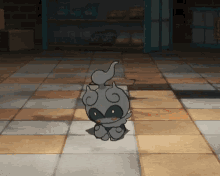

---

  <b>Confira o meu portfólio de projetos </b>  
  

  <b>Minha Experiência de Trabalho </b>  
  

      

> [!WARNING]
> Shadow Voidh é o Melhor de todos os Tempo .

### About me:
- $\color{#F4C430}{\text{👑 The Real King \.}}$
- $\color{#EF4444}{\text{☕16y\.}}$
- $\color{#C084FC}{\text{⚡ Focado em programar em low level "ou não k" e explorar hardware/software.}}$
- $\color{#EF4444}{\text{🎯 Criando projetos em C, C++ e Csharps\.}}$
- $\color{#C084FC}{\text{🚀 Sempre estudando e buscando aprender algo novo a cada dia.}}$

Interessado desde novo em Desenvolvimento de Jogos e Aplicativos .

---
<h3 align="center">Linguagens & Tecnologias</h3>

<h3 align="center"> 💻 Linguagens Principais: </h3>

 

<h3 align="center"> 🖥 Linguagens Secundárias </h3>

 

  

 

<h3 align="center">🛠️ Ferramentas & IDEs </h3>

   
 
 
 
  

<h3 align="center">💻 Sistemas Operacionais </h3>

  
  
  
  
  
  

---

  
  

### About me part. TWO :

Desenvolvedor C++ & C# 

>  🖥Programando em low-level Focado em engenharia de software, desenvolvimento de jogos e aplicações nativas.

> 🔧 Stack Principal: C, C++, C# 📚 Estudante em constante evolução

> 🌑Atualmente aprofundando conhecimentos em lógica de programação e arquitetura de sistemas 

 
---

  

  

  
  
  &nbsp;
  
   
  &nbsp;

  
  &nbsp;
 
  

 
